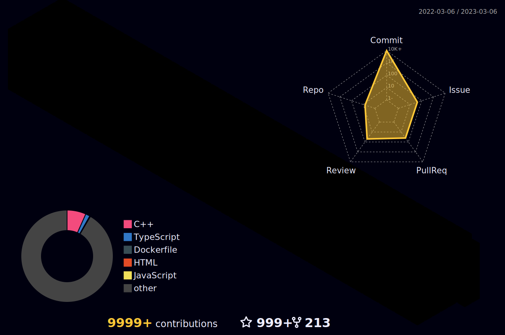

<h3 align="center">
<a href="https://git.io/typing-svg"></a>
</h3>

## :mailbox: Reach me out

- 🌱 I’m currently learning **Angular.js and Vue.js**

- 👨‍💻 All of my projects are available at [https://github.com/codewithashim](https://github.com/codewithashim)

- 💬 Ask me about **react.js**

- 📫 How to reach me **codewithashim@gmail.com**

<h3 align="left">Connect with me:</h3>
<p align="left">
  <a href="https://codepen.io/codewithashim" target="blank"></a>
  <a href="https://twitter.com/codewithashim" target="blank"></a>
  <a href="https://linkedin.com/in/codewithashim" target="blank"></a>
  <a href="https://codesandbox.com/codewithashim" target="blank"></a>
  <a href="https://fb.com/codewithashim" target="blank"></a>
  <a href="https://instagram.com/codewithashim" target="blank"></a>
</p>


<br/>

**𝙻𝙰𝙽𝙶𝚄𝙰𝙶𝙴𝚂 𝙰𝙽𝙳 𝚃𝙾𝙾𝙻𝚂:**

<br/>
<br/>
<p align="center">
    
    
    
    
    
    
    
    
</p>

#

<p align="center">
<code></code>
<code></code>
<code></code>
<code></code>
<code></code>
<code></code>
<code></code>
<code></code>
<code></code>
</p>
<br/>

#

<br/>



<h4 align="center">
  
```diff
+@ @ @ @ @ @ @ @ @ @ @ @ @ @ @ @ @ @ @ @ @ @ @ @ @ @ @ @+
@@       o o                                           @@
@@       | |                                           @@
@@      _L_L_                                          @@
@@   ❮\/__-__\/❯ Programming isn't about what you know @@
@@   ❮(|~o.o~|)❯  It's about what you can figure out   @@
@@   ❮/ \`-'/ \❯                                       @@
@@     _/`U'\_                                         @@
@@    ( .   . )     .----------------------------.     @@
@@   / /     \ \    | while( ! (succeed=try() ) ) |    @@
@@   \ |  ,  | /    '----------------------------'     @@
@@    \|=====|/           </> Codewithashim            @@
@@     |_.^._|                                         @@
@@     | |"| |                                         @@
@@     ( ) ( )   Testing leads to failure              @@
@@     |_| |_|   and failure leads to understanding    @@
@@ _.-' _j L_ '-._                                     @@
@@(___.'     '.___)                                    @@
+@ @ @ @ @ @ @ @ @ @ @ @ @ @ @ @ @ @ @ @ @ @ @ @ @ @ @ @+
```

</h4>  
  


